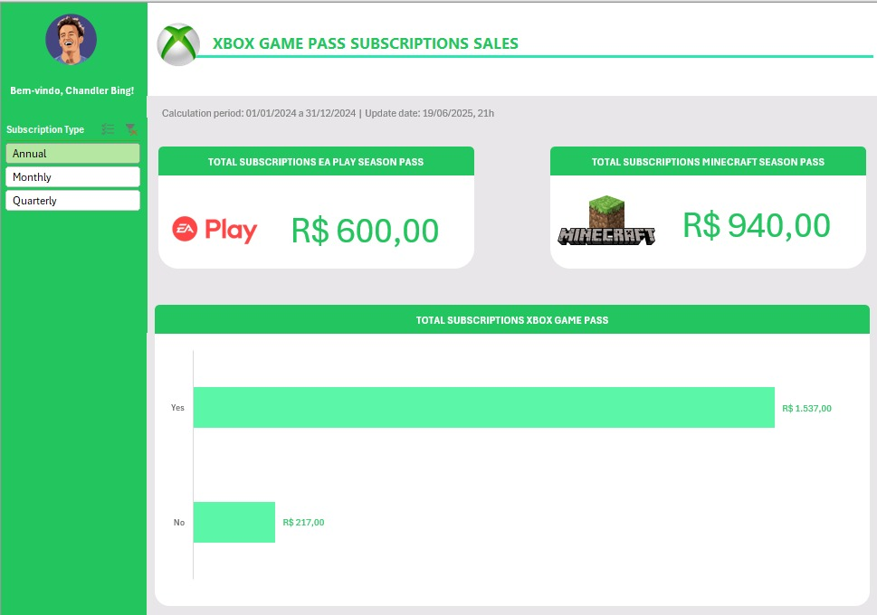

<h1 align="center">🎮 Dashboard de Vendas - Xbox Game Pass</h1>

  📊 Projeto educacional de análise de vendas com Excel interativo  
  🔍 Foco em perguntas de negócio e visualização para tomada de decisão

---

## 📌 Sobre o Projeto

Este dashboard foi criado com o objetivo de consolidar dados de vendas de assinaturas do **Xbox Game Pass**, permitindo análise segmentada por tipo de plano (Mensal, Trimestral, Anual) e visão clara de pacotes vendidos (EA Play e Minecraft).

Interface interativa feita 100% no Excel.

---

## 🖼️ Prévia do Dashboard

  

---

## ⚙️ Funcionalidades

✅ Segmentação de dados por tipo de assinatura  
✅ Cards com KPIs de vendas consolidadas  
✅ Gráfico dinâmico de adesão (Sim/Não)  
✅ Dados atualizados e período definido (01/01/2024 – 31/12/2024)  
✅ Interface intuitiva para uso por gestores  

---

## 📁 Estrutura do Arquivo

- `Dashboard Xbox.xlsx` → arquivo com todas as abas (ocultas) contendo base de dados e cálculos.
- A aba principal é o **painel do gestor** (a própria Dashboard), desenhada para visualização e tomada de decisão.

As outras abas estão ocultas para manter a navegação simples e direcionada à análise da liderança.

---

## 🚀 Como Utilizar

1. Faça o download do arquivo `Dashboard Xbox.xlsx`.
2. Abra no Excel (versão 2016 ou superior).
3. Use os botões laterais para segmentar os dados.
4. Veja os resultados atualizarem automaticamente nos cards e gráfico.

---

## 🎯 Habilidades Aplicadas

- Excel Avançado com segmentações de dados  
- Criação de dashboards interativos  
- Design focado em experiência do usuário  
- Organização de dados para tomada de decisão  

---

## 📎 Observações

📌 Este é um projeto **educacional guiado**, com dados fictícios para fins de prática em visualização e análise.

---

Curtiu? ⭐ Considere dar uma estrela no repositório para apoiar o trabalho! 
